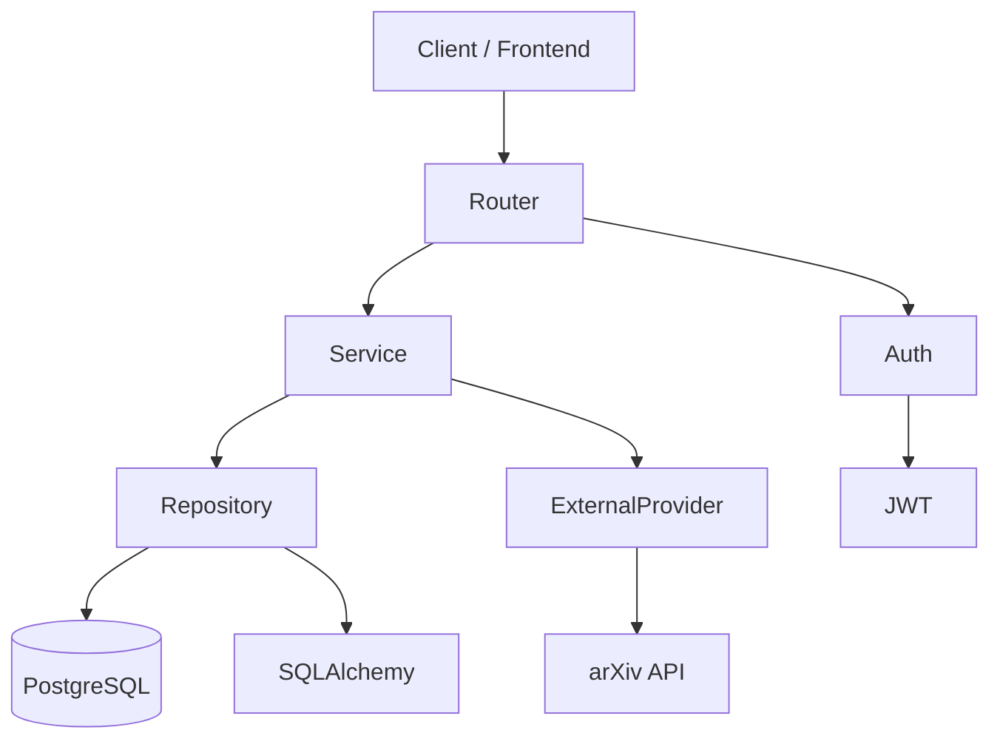

# 🔬 ResearchNest

> **Search Smarter. Research Better.**

ResearchNest is a production-oriented AI-powered research platform designed to help researchers discover, organize, and analyze scientific literature.

The project is being built with modern Software Engineering, Backend Engineering, and MLOps best practices, evolving from a research paper management system into a complete AI research assistant with RAG, semantic search, recommendations, and LLM-powered features.

---

## 🚀 Current Features

- ✅ JWT Authentication
- ✅ User Management
- ✅ Research Paper CRUD
- ✅ Ownership Authorization
- ✅ Search API with Pagination
- ✅ arXiv Integration
- ✅ Global Exception Handling
- ✅ Docker & Docker Compose
- ✅ PostgreSQL
- ✅ Alembic Database Migrations
- ✅ GitHub Actions CI
- ✅ Ruff + Black
- ✅ Pytest + Coverage Reporting

---

## 🛠️ Tech Stack

### Backend

- Python 3.13
- FastAPI
- SQLAlchemy
- PostgreSQL
- Alembic
- Pydantic v2
- JWT Authentication

### Testing

- Pytest
- pytest-cov
- Mocking
- Dependency Overrides

### DevOps

- Docker
- Docker Compose
- GitHub Actions
- Ruff
- Black
- Pre-commit

### External APIs

- arXiv API
- httpx
- feedparser

---

## 📈 Project Status

Current Version:

```text
v1.4.x
```

Current Focus:

- Documentation
- Async FastAPI Migration
- Redis Integration
- Multiple Research Providers

---

## 🎯 Long-Term Vision

ResearchNest is evolving into an AI research platform capable of:

- Semantic Search
- Research Recommendations
- Paper Summarization
- Literature Review Generation
- PDF Chat (RAG)
- Vector Search
- MLOps Pipeline
- Model Monitoring
- MLflow Integration

---

## 📄 License

This project is currently under active development.

---

# 📁 Project Structure

```text
ResearchNest/
├── backend/
│   ├── app/
│   │   ├── clients/
│   │   ├── core/
│   │   ├── database/
│   │   ├── dependencies/
│   │   ├── exceptions/
│   │   ├── middleware/
│   │   ├── models/
│   │   ├── repositories/
│   │   ├── routers/
│   │   ├── schemas/
│   │   ├── services/
│   │   └── tests/
│   ├── alembic/
│   ├── Dockerfile
│   ├── requirements.txt
│   └── pyproject.toml
│
├── docker-compose.yml
│
└── README.md
```

---

# 🚀 Local Development

Clone the repository:

```bash
git clone <repository-url>
cd ResearchNest
```

Create and activate a virtual environment:

```bash
cd backend

python -m venv .venv

# Windows
.venv\Scripts\activate

# Linux / macOS
source .venv/bin/activate
```

Install dependencies:

```bash
pip install -r requirements.txt
```

Run the application:

```bash
uvicorn app.main:app --reload
```

Open:

```
http://localhost:8000/docs
```

---

# 🐳 Docker

Build and start the application:

```bash
docker compose up --build
```

Stop:

```bash
docker compose down
```

---

# 🧪 Running Tests

Run all tests:

```bash
pytest
```

Run coverage:

```bash
pytest --cov=app
```

---

# ⚙️ Environment Variables

Local development:

```
backend/.env
```

Docker:

```
backend/.env.docker
```

Template:

```
backend/.env.example
```
## 🏗️ Architecture


### Layered Architecture

```text
┌───────────────────────────────┐
│          FastAPI Routers      │
├───────────────────────────────┤
│          Services             │
├───────────────────────────────┤
│ Repositories │ External APIs  │
├───────────────────────────────┤
│ PostgreSQL   │ arXiv API      │
└───────────────────────────────┘
```
## 📡 API Overview

| Endpoint | Method | Authentication | Description |
|----------|--------|----------------|-------------|
| `/auth/login` | POST | ❌ | Authenticate a user and return a JWT access token. |
| `/papers` | GET | ✅ | Retrieve all papers owned by the authenticated user. |
| `/papers` | POST | ✅ | Create a new research paper. |
| `/papers/{paper_id}` | GET | ✅ | Retrieve a specific research paper by ID. |
| `/papers/{paper_id}` | PUT | ✅ | Update an existing research paper. |
| `/papers/{paper_id}` | DELETE | ✅ | Delete a research paper. |
| `/papers/search` | GET | ✅ | Search papers with pagination support. |
| `/research/search` | GET | ❌ | Search external research papers using the arXiv API. |

### Highlights

- 🔐 JWT Authentication
- 🏗️ Clean Architecture
- 📦 Repository Pattern
- 🔄 Dependency Injection
- 🐘 PostgreSQL
- 🚀 FastAPI
- 🧪 63 Automated Tests
- 🐳 Docker & Docker Compose
- ⚙️ GitHub Actions CI
- 🎨 Ruff + Black Formatting
- 🔍 arXiv Research Integration